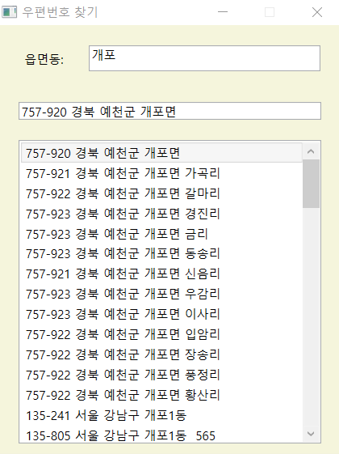

# zipcode_search
> 학부생 3학년 1학기 때 진행한 닷넷프레임워크를 이용한 우편번호검색 프로그램

## Installation
-

## Usage example

데이터베이스와 연동하여 읍면동을 입력하면 주소와 우편번호를 출력하는 프로그램

## Development setup

IDE: Visual Studio 2019

DBMS: MS Access 2010

Framework: .Net 4.7.2

## Release History

* 1.0.0
    * first
    * 개발 완료

## Meta

김준혁 – wnsgur1198@naver.com

## Contributing

1. Fork it (<https://github.com/yourname/yourproject/fork>)
2. Create your feature branch (`git checkout -b feature/fooBar`)
3. Commit your changes (`git commit -am 'Add some fooBar'`)
4. Push to the branch (`git push origin feature/fooBar`)
5. Create a new Pull Request

<!-- Markdown link & img dfn's -->
